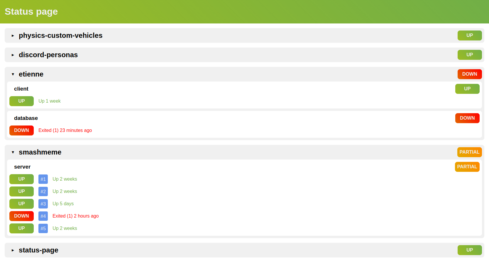

# Status page for docker compose projects

This is a simple status page for docker compose projects. It will show the status of the services defined in each docker-compose file. It will also show the status of the containers running in each service.

## Usage

Just clone, run `docker compose up` and open `http://localhost:5747` in your browser.

## Screenshot

